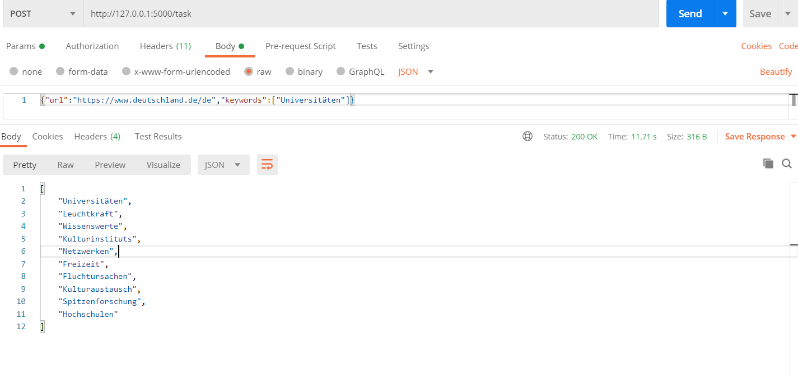

# word-extraction

Word-extraction is a Python web RESTFUL API based on FLASK for extracting the most relevant words from website based on keywords
this api supports extracting data from websites in the following languages (English, German and French)

## The Architecture
Word-extraction consists of 3 main components 
- ```DataHelper```: which is a class responsible for ```loading ,cleaning and detecting the langauge``` of the website by using 
  - [beautifulsoup4](https://pypi.org/project/beautifulsoup4/): for removing the ```HTML``` tags and large spaces
  - [LangDetect](https://pypi.org/project/langdetect/): to identify the language of the website
  - requests:- for requesting the data of the website ``` but some SSL certifcates rejects the request and throws an excepetion```
- ```TaskImpl```:- Which process the data from the website and applies further cleaning to it then it vectorizes the data using ```sent2vec``` and get the most similar words to the keywords by measuring the distances between keywords vectors and website vectors and it uses:-
  - [Spacy](https://pypi.org/project/spacy/):- After loading the spacy model based on the detected language we use the mode to clean the data from ```stop_words```,```emojies``` ...etc
  - [Sent2Vec](https://pypi.org/project/sent2vec/) :- Which vectorizes the data using ```Bert``` and despite being time consuming but it has 2 important features
      - supportinig multiple languages
      - vectorizes the scentence based on the context not just the words (for example it would differenciate between money Bank and power bank )
- ```api```:
  Which is the entry point of the python script and it recieves the input from the client as JSON object and returns JSON array of the result
  
#Notes:-
I prefered using ```Bert``` over ```word2vec``` despite the time complexity of it because I can use it with multiple languages and I don't need large models like word2vec
also because the Keywords will probably be Ngrams not just a single word 
## Installation

- run the following command to install the packages needed for the API

```bash
pip install -r requirements.txt
```

## Running the Server
to start the RESTFUL API run the following commands 
On Linux based systems 
```bash
export FLASK_APP=api.py
flask run
```
on Windows CMD
```
set FLASK_APP=api.py
flask run
```
for further information about running flask you can find more info in this [link](https://flask.palletsprojects.com/en/1.1.x/quickstart/)

## Consuming the API 
now that you have started the server you can start consuming the API there is only one endpoint ```/task```
this endpoint accepts ```POST``` requests only and the body should be in ```JSON``` format
body example 

      ```{"url":"https://www.deutschland.de/de","keywords":["Universitäten"]}```
And the API would return a ```JSON Array``` of the nearest words to the ```keywords```
response example :-

```python
["Universitäten",
    "Leuchtkraft",
    "Wissenswerte",
    "Kulturinstituts",
    "Netzwerken",
    "Freizeit",
    "Fluchtursachen",
    "Kulturaustausch",
    "Spitzenforschung",
    "Hochschulen"]
```


## Future work
- Supporting more languages
- Write unit tests for the functions
- Overcome the SSL certifcate issue that happens with a lot of websites
